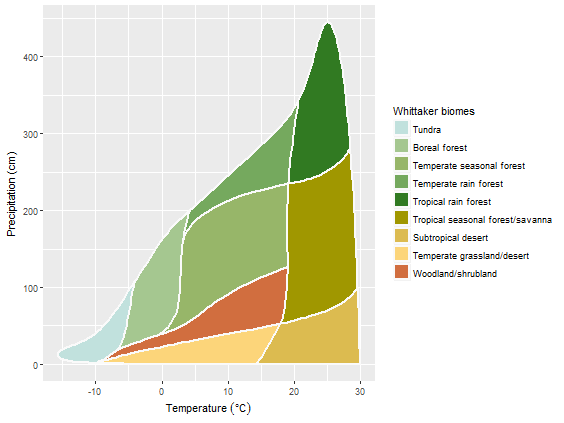

# plotbiomes
[](https://doi.org/10.5281/zenodo.7145245)
<!-- CI badges -->
[](https://ci.appveyor.com/project/valentinitnelav/plotbiomes/branch/develop)
[](https://travis-ci.org/valentinitnelav/plotbiomes)
[](https://codecov.io/github/valentinitnelav/plotbiomes?branch=master)

<!--
Fixing errors from Travis CI can be time consuming ... 
I gave up since the effort to fix the errors is not worth the time!
The AppVeyor passes gracefully and that is enough for me.
In Travis, last errors came from `sf` package due to `GDAL` problems
I tried some suggestions from here: https://stackoverflow.com/a/12143411/5193830 
but could not fix it...
-->

## Overview

R package for plotting [Whittaker' biomes](https://en.wikipedia.org/wiki/Biome#Whittaker_.281962.2C_1970.2C_1975.29_biome-types) with [ggplot2](https://github.com/tidyverse/ggplot2).

The original graph is Figure 5.5 in *Ricklefs, R. E. (2008), The economy of nature. W. H. Freeman and Company.* (Chapter 5, Biological Communities, The biome concept). The figure was processed and brought into an R friendly format. Details are given in [Whittaker_biomes_dataset.html](https://rawgit.com/valentinitnelav/plotbiomes/master/html/Whittaker_biomes_dataset.html) document.

Plotting Whittaker' biomes was also addressed in [BIOMEplot](https://github.com/kunstler/BIOMEplot) package by Georges Kunstler and in [ggbiome](https://github.com/guillembagaria/ggbiome) package by Guillem Bagaria, Victor Granda and Georges Kunstler.

## Installation

You can install `plotbiomes` from github with:

``` r
# install.packages("devtools")
devtools::install_github("valentinitnelav/plotbiomes")
```

## Examples & Vignettes

Check examples at [Whittaker_biomes_examples.html](https://rawgit.com/valentinitnelav/plotbiomes/master/html/Whittaker_biomes_examples.html) and [Check_outliers.html](https://rawgit.com/valentinitnelav/plotbiomes/master/html/Check_outliers.html) vignettess. 

Simple example of plotting Whittaker' biomes:

``` r
library(plotbiomes)

whittaker_base_plot()
```

<!--
library(ggplot2)
ggsave(filename = "man/figures/README-example-1.png", dpi = 75)
-->



# How to cite the package?

I just uploaded this packge on Zenodo after almost 5 years :)
I noticed that there are several forks by now and I presume people adapt it to their needs, plus I do not have the time to fully maintain this.
Nevertheless, would be nice to cite this package if you make use of it.

You can cite the first release of the package as:

> Valentin Ștefan, & Sam Levin. (2018). plotbiomes: R package for plotting Whittaker biomes with ggplot2 (v1.0.0). Zenodo. https://doi.org/10.5281/zenodo.7145245

Examples of scientific papers using and citing the package can be found [here](https://scholar.google.com/scholar?cites=2391488723410980978&as_sdt=2005&sciodt=0,5&hl=en):

Wolf, S., Mahecha, M.D., Sabatini, F.M. et al. Citizen science plant observations encode global trait patterns. Nat Ecol Evol (2022). https://doi.org/10.1038/s41559-022-01904-x

Carmona, C.P., Bueno, C.G., Toussaint, A., Träger, S., Díaz, S., Moora, M., Munson, A.D., Pärtel, M., Zobel, M. and Tamme, R., 2021. Fine-root traits in the global spectrum of plant form and function. Nature, 597(7878), pp.683-687.

Laughlin, D.C., Mommer, L., Sabatini, F.M., Bruelheide, H., Kuyper, T.W., McCormack, M.L., Bergmann, J., Freschet, G.T., Guerrero-Ramírez, N.R., Iversen, C.M. and Kattge, J., 2021. Root traits explain plant species distributions along climatic gradients yet challenge the nature of ecological trade-offs. Nature Ecology & Evolution, 5(8), pp.1123-1134.

Hammond, W.M., Williams, A.P., Abatzoglou, J.T., Adams, H.D., Klein, T., López, R., Sáenz-Romero, C., Hartmann, H., Breshears, D.D. and Allen, C.D., 2022. Global field observations of tree die-off reveal hotter-drought fingerprint for Earth’s forests. Nature communications, 13(1), pp.1-11.

Lembrechts, J.J., Van den Hoogen, J., Aalto, J., Ashcroft, M.B., De Frenne, P., Kemppinen, J., Kopecký, M., Luoto, M., Maclean, I.M., Crowther, T.W. and Bailey, J.J., 2022. Global maps of soil temperature. Global Change Biology, 28(9), pp.3110-3144.

Falster, D., Gallagher, R., Wenk, E.H., Wright, I.J., Indiarto, D., Andrew, S.C., Baxter, C., Lawson, J., Allen, S., Fuchs, A. and Monro, A., 2021. AusTraits, a curated plant trait database for the Australian flora. Scientific Data, 8(1), pp.1-20.

Massante, J.C., Götzenberger, L., Takkis, K., Hallikma, T., Kaasik, A., Laanisto, L., Hutchings, M.J. and Gerhold, P., 2019. Contrasting latitudinal patterns in phylogenetic diversity between woody and herbaceous communities. Scientific reports, 9(1), pp.1-10.


